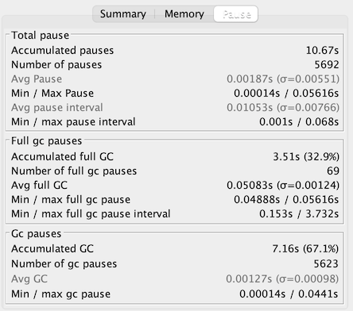

# 运行环境

- 系统 :  MacOS Big Sur
- 处理器:  2.9 GHz 六核Intel Core i9
- 内存：32 GB 2400 MHz DDR4
- JDK：1.8.0_271

# 目标程序

测试之前，对测试的代码进行了一些改造，主要是为了移除掉随机性，因为几个GC在短时间内的执行效果偏差不是量级的，所以随机性会导致比对不客观

改造点如下：

- 随机写入cachedGarbage 改成 每4次生产垃圾，就有1次写入cachedGarbage，不过写入的序列位置是随机的
- 每次生产的垃圾不再是随机类型随机长度，而是定长的100*1024 string
- 执行时长改为60s，方便VisualGC等程序接入观察

固定运行环境的 Heap上限是512M，来调试这个环境下各个GC算法的表现

```java

import java.util.Random;
import java.util.concurrent.TimeUnit;
import java.util.concurrent.atomic.LongAdder;
/*
演示GC日志生成与解读
*/
public class GCLogAnalysis {
    private static Random random = new Random();
    public static void main(String[] args) {
        // 当前毫秒时间戳
        long startMillis = System.currentTimeMillis();
        // 持续运行毫秒数; 可根据需要进行修改
        long timeoutMillis = TimeUnit.SECONDS.toMillis(60);
        // 结束时间戳
        long endMillis = startMillis + timeoutMillis;
        LongAdder counter = new LongAdder();
        System.out.println("正在执行...");
        // 缓存一部分对象; 进入老年代
        int cacheSize = 2000;
        Object[] cachedGarbage = new Object[cacheSize];
        // 在此时间范围内,持续循环
        while (System.currentTimeMillis() < endMillis) {
            // 生成垃圾对象
            Object garbage = generateGarbage(100*1024);
            counter.increment();
            int randomIndex = random.nextInt(2 * cacheSize);
            // if (randomIndex < cacheSize) {
                // cachedGarbage[randomIndex] = garbage;
            // }
            if (counter.longValue()%4==0) {
                cachedGarbage[randomIndex%cacheSize] = garbage;
            }
        }
        System.out.println("执行结束!共生成对象次数:" + counter.longValue());
    }

    // 生成对象
    private static Object generateGarbage(int max) {
        // int randomSize = random.nextInt(max);
        // int type = randomSize % 4;
        // Object result = null;
        // switch (type) {
        //     case 0:
        //         result = new int[randomSize];
        //         break;
        //     case 1:
        //         result = new byte[randomSize];
        //         break;
        //     case 2:
        //         result = new double[randomSize];
        //         break;
        //     default:
        //         StringBuilder builder = new StringBuilder();
        //         String randomString = "randomString-Anything";
        //         while (builder.length() < randomSize) {
        //             builder.append(randomString);
        //             builder.append(max);
        //             builder.append(randomSize);
        //         }
        //         result = builder.toString();
        //         break;
        // }
        // return result;
        StringBuilder builder = new StringBuilder();
        String randomString = "abcde12345";
        while (builder.length() < max) {
            builder.append(randomString);
        }
        return builder.toString();
    }
}
```

#Serial GC

```shell
java -XX:+UseSerialGC -Xms512m -Xmx512m -Xloggc:SerialGC.log -XX:+PrintGCDetails -XX:+PrintGCDateStamps GCLogAnalysis
```

结果如下：

```
执行结束!共生成对象次数:200288
```

通过分析GC日志 `SerialGC.log`,  如下信息：


一共触法了1549次GC，其中Full GC 1477次，因为GC，被打断了33.07s, 这个性能损耗是非常大的，程序的整个运行时间只有60s的情况下，有33s在进行GC操作。

我们再来看 VisualGC的数据


Old Gen 在一开始就被占满了，整个过程很少能被明显的GC下来，这个在GC日志中也可以看到,  Old Gen基本没有被GC下来，导致一直处于Full GC状态，因为程序随机分配可能不会被分配进数组而直接在Eden Space中就被抛弃，所以这个状态下还能间歇性的跑一跑，但是效率已经非常低下了


因为SerialGC下，GC 和 Full GC 耗时是差不多的, GC 略快一些，所以即使 Full GC已经占满了，照道理调大Old Gen会减少一部分Full GC，增加GC的次数，性能应该会有提升

```shell
java -XX:+UseSerialGC -Xms512m -Xmx512m -XX:NewRatio=5 -Xloggc:SerialGC-FiexedOld.log -XX:+PrintGCDetails -XX:+PrintGCDateStamps GCLogAnalysis
```

```shell
执行结束!共生成对象次数:262230
```

# Parallel GC

```shell
java -XX:+UseParallelGC -Xms512m -Xmx512m -Xloggc:ParallelGC.log -XX:+PrintGCDetails -XX:+PrintGCDateStamps GCLogAnalysis
```

执行结果如下：

```
执行结束!共生成对象次数:133991
```

这里非常诡异的事情发生了，并行回收居然还远不如单线程回收，连一半性能都没有，我们尝试分析下这里的原因

首先分析GC打断信息


一共有1132次GC，其中Full GC 1048次，一共居然被打断了39.61s，相对于60s的执行时间，也就是基本没有处于执行状态了，为什么会执行如此多次的 Full GC呢，查询资料发现，ParallelGC 是一种悲观策略的GC

指的是**发生YGC过程中**：

- *【执行YGC前】*，先取值 **Min**(*之前晋升Old区的平均大小*，*当前Eden所使用的空间大小*)，跟**Old当前所剩空间**进行比较，若前者比较大则**停止当前YGC**，直接触发Full GC
- *【执行YGC后】*，计算平均晋升到Old的大小，若**大于**Old所剩空间，则**触发Full GC**

由此可见，YGC太多而Old Gen不足时，会频繁提前触发Full GC

我们观察 VisualGC的图来确认下：


这个图里发现了一个非常诡异的地方，ParalleGC下，JVM给Survivor分配了一个非常大的空间，这个空间在整个运行过程中都没有被用到，而 Eden Space只占据了135M的实际可用空间，虽然上限时169M，但是却无法提升（因为实际的heap size已经耗尽了），Old Gen时完全满载的，这个时SerialGC一样，Eden Space过小导致YGC触法条件满足的次数非常多，YGC升级升的FullGC也非常多，我们知道，管控Eden Space和Survivor的配比的是SurvivorRatio参数，默认值为8，也就是Eden要占到整个年轻代的80%，查询资料得知如下：

> HotSpot VM里，ParallelScavenge系的GC（UseParallelGC / UseParallelOldGC）默认行为是SurvivorRatio如果不显式设置就没啥用。显式设置到跟默认值一样的值则会有效果，因为ParallelScavenge系的GC最初设计就是默认打开AdaptiveSizePolicy的，它会自动、自适应的调整各种参数

那我们调整一次参数，显式的声明下SurvivorRatio，并增大配比

```shell
java -XX:+UseParallelGC -Xms512m -Xmx512m -XX:SurvivorRatio=9 -Xloggc:ParallelGC-FixedEden.log -XX:+PrintGCDetails -XX:+PrintGCDateStamps GCLogAnalysis
```

执行结果如下：

```
执行结束!共生成对象次数:135746
```

依然没有质的提升，为什么呢？

我们再来看一次中断信息：


总的GC次数只是略微的下降了

这样的效果依然不够好，因为Old Gen完全占满，才导致的Surivor失去了作用，所以如果扩大Old Gen，那么自动配比的Surivor是不是能更好的工作了呢？

```shell
java -XX:+UseParallelGC -Xms512m -Xmx512m -Xloggc:ParallelGC-FixedOld.log -XX:NewRatio=5 -XX:+PrintGCDetails -XX:+PrintGCDateStamps GCLogAnalysis
```

结果果然

```
执行结束!共生成对象次数:272270
```

这个时候GC的中断信息如下, 中断时间下降到22s，Full GC次数明显下降，Gc的次数虽然上升，但是相比于SerialGC，ParallelGC的GC Pauses实在快太多了。


# CMS GC

```shell
java -XX:+UseConcMarkSweepGC -Xms512m -Xmx512m -Xloggc:ConcMarkSweepGC.log -XX:+PrintGCDetails -XX:+PrintGCDateStamps GCLogAnalysis
```

执行结果如下：

```
执行结束!共生成对象次数:139346
```

在默认配置下，CMS GC和ParallelGC差不多，我们查看下中断信息


我们看到，CMS GC 在 GC的耗时上，接近甚至略好于ParallelGC，但是默认配置下，Full GC达到了787次，整体的打断达到了42s多 ( CMS 是并发Full GC，所以可以理解成是竞争而不是打断)，主要的原因还是因为 Old Gen不足，我们一样调大Old Gen到同样比例试试

```shell
java -XX:+UseConcMarkSweepGC -Xms512m -Xmx512m -Xloggc:ConcMarkSweepGC-FixedOld.log -XX:NewRatio=5 -XX:+PrintGCDetails -XX:+PrintGCDateStamps GCLogAnalysis
```

```
执行结束!共生成对象次数:379420
```

这个时候的GC信息如下, Full GC 明显下降：



# G1 GC

```shell
java -XX:+UseG1GC -Xms512m -Xmx512m -Xloggc:G1GC.log -XX:+PrintGCDetails -XX:+PrintGCDateStamps GCLogAnalysis
```

执行结果如下：

```
执行结束!共生成对象次数:254911
```

在默认参数下，G1是表现最好的GC了，我们看下GC信息


可以看到，完全没有触发FullGC，单次的GC效率也是最高的，就是GC的次数有点多，我们看下VisualGC信息


乍一看，G1好像并不是很出彩，但是G1的特性在堆越大的时候就越突出

我们对比下8g下的各个GC的状态

```shell
# Serial GC
java -XX:+UseSerialGC -Xms8g -Xmx8g -XX:NewRatio=5 -Xloggc:SerialGC-FiexedOld.log -XX:+PrintGCDetails -XX:+PrintGCDateStamps GCLogAnalysis
正在执行...
执行结束!共生成对象次数:443687
# Parallel GC
java -XX:+UseParallelGC -Xms8g -Xmx8g -Xloggc:ParallelGC-FixedOld.log -XX:NewRatio=5 -XX:+PrintGCDetails -XX:+PrintGCDateStamps GCLogAnalysis
正在执行...
执行结束!共生成对象次数:472049
# CMS GC
java -XX:+UseConcMarkSweepGC -Xms8g -Xmx8g -Xloggc:ConcMarkSweepGC-FixedOld-xms2g.log -XX:NewRatio=5 -XX:+PrintGCDetails -XX:+PrintGCDateStamps GCLogAnalysis
正在执行...
执行结束!共生成对象次数:443807
# G1 GC
java -XX:+UseG1GC -Xms8g -Xmx8g -Xloggc:G1GC.log -XX:+PrintGCDetails -XX:+PrintGCDateStamps GCLogAnalysis
正在执行...
执行结束!共生成对象次数:511121
```

立马就看到了质的差别

# 总结

GCLogAnalysis这个程序，特征是老年代的开销非常大

当机器的资源不足，年老代且数据持久，GC不掉，长期满载时，这个时候谁的Full GC频次能下降，GC效率高，次数少，谁的优势就大，SerialGC是单线程GC，单没有CPU上下文切换的时候是有优势的，但是在我这个6核电脑里就显得GC效率太差了，ParallelGC 虽然GC的效率上去了，但是打断的次数太多，导致执行次数减少，CMSGC的并行GC方式，反而更适合这个程序的性能提升，是最佳的方案

当机器资源富足，有较大的堆时，前三种算法的差距并不是太大，G1 GC独特的内存分配方案和回收机制的优势就体现出来了

当然，本文的参数调整并不严谨，因为程序的实现单一，理论上4个GC仔细调整参数，都能达到极限性能，SerialGC 可能略差，真实的实战场景上来说，不调优参数的情况下，G1 GC能发挥出最好的效果，但是真实要发挥最佳的性能，还是需要结合服务本身，调整堆栈，机器，以及回收算法的参数配比，并没有最好的算法，只有最合适的算法